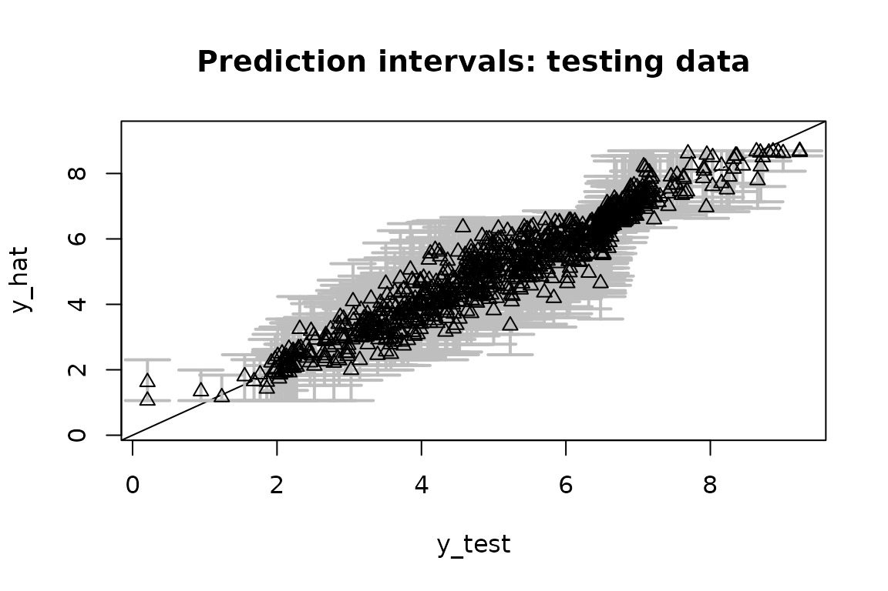
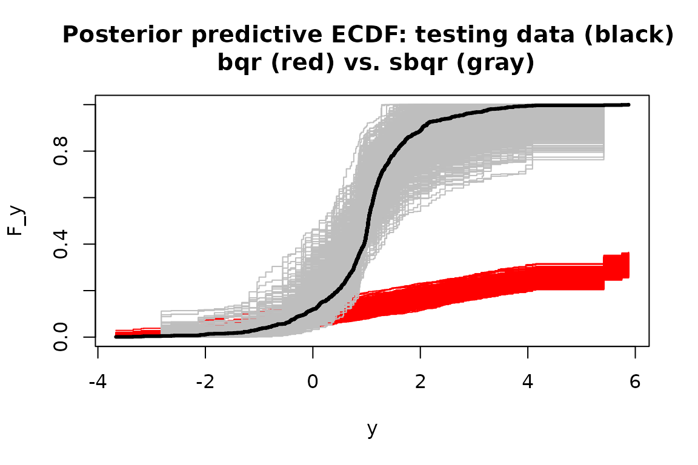
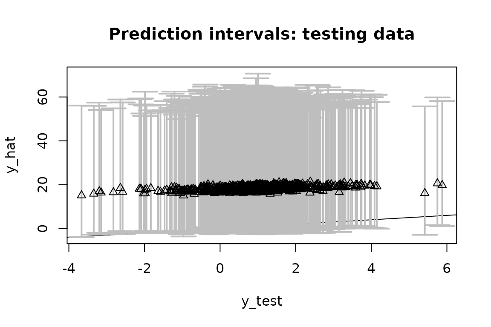
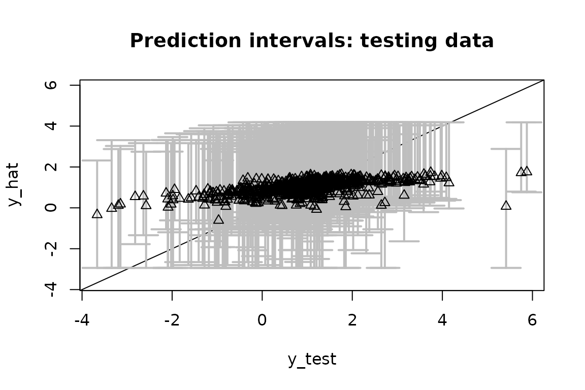
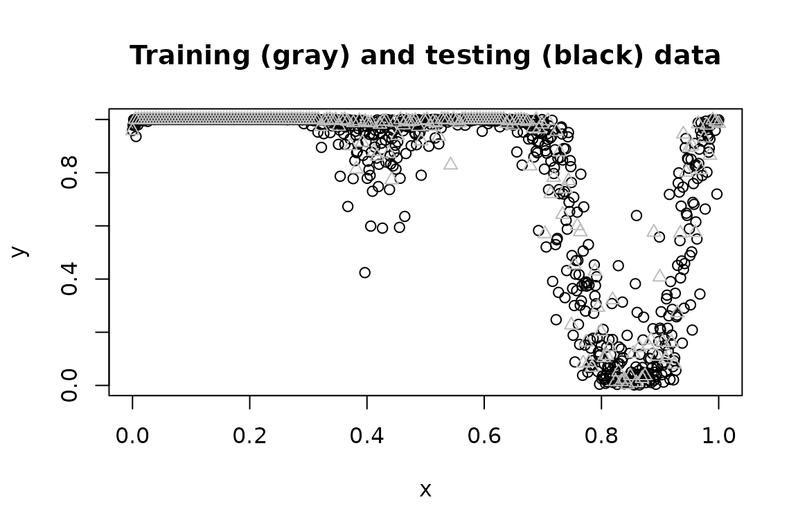

# Introduction to SeBR

## Background: semiparametric regression via data transformations

Data transformations are a useful companion for parametric regression
models. A well-chosen or learned transformation can greatly enhance the
applicability of a given model, especially for data with irregular
marginal features (e.g., multimodality, skewness) or various data
domains (e.g., real-valued, positive, or compactly-supported data).

We are interested in providing fully Bayesian inference for
*semiparametric regression models* that incorporate (1) an unknown data
transformation and (2) a useful parametric regression model. For paired
data $\{ x_{i},y_{i}\}_{i = 1}^{n}$ with $x_{i} \in {\mathbb{R}}^{p}$
and $y \in \mathcal{Y} \subseteq {\mathbb{R}}$, consider the following
class of models:
$$g\left( y_{i} \right) = z_{i}$$$$z_{i} = f_{\theta}\left( x_{i} \right) + \sigma\epsilon_{i}$$
Here, $g$ is a (monotone increasing) data transformation to be learned,
$f_{\theta}$ is an unknown regression function parametrized by $\theta$,
and $\epsilon_{i}$ are independent errors. Location and scale
restrictions (e.g., $f_{\theta}(0) = 0$ and $\sigma = 1$) are usually
applied for identifiability.

**Examples.** We focus on the following important special cases:

1.  The **linear model** is a natural starting point:
    $$z_{i} = x_{i}\prime\theta + \sigma\epsilon_{i},\quad\epsilon_{i}\overset{iid}{\sim}N(0,1)$$
    The transformation $g$ broadens the applicability of this useful
    class of models, including for positive or compactly-supported data
    (see below).

2.  The **quantile regression model** replaces the Gaussian assumption
    in the linear model with an *asymmetric Laplace* distribution (ALD)
    $$z_{i} = x_{i}\prime\theta + \sigma\epsilon_{i},\quad\epsilon_{i}\overset{iid}{\sim}ALD(\tau)$$
    to target the $\tau$th quantile of $z$ at $x$, or equivalently, the
    $g^{- 1}(\tau)$th quantile of $y$ at $x$. The ALD is quite often a
    very poor model for real data, especially when $\tau$ is near zero
    or one. The transformation $g$ offers a pathway to significantly
    improve the model adequacy, while still targeting the desired
    quantile of the data.

3.  The **Gaussian process (GP) model** generalizes the linear model to
    include a nonparametric regression function,
    $$z_{i} = f_{\theta}\left( x_{i} \right) + \sigma\epsilon_{i},\quad\epsilon_{i}\overset{iid}{\sim}N(0,1)$$
    where $f_{\theta}$ is a GP and $\theta$ parameterizes the mean and
    covariance functions. Although GPs offer substantial flexibility for
    the regression function $f_{\theta}$, the default approach (without
    a transformation) may be inadequate when $y$ has irregular marginal
    features or a restricted domain (e.g., positive or compact).

**Challenges:** The goal is to provide fully Bayesian posterior
inference for the unknowns $(g,\theta)$ and posterior predictive
inference for future/unobserved data $\widetilde{y}(x)$. We prefer a
model and algorithm that offer both (i) flexible modeling of $g$ and
(ii) efficient posterior and predictive computations.

**Innovations:** Our approach
(<https://doi.org/10.1080/01621459.2024.2395586>) specifies a
*nonparametric* model for $g$, yet also provides *Monte Carlo* (not
MCMC) sampling for the posterior and predictive distributions. As a
result, we control the approximation accuracy via the number of
simulations, but do *not* require the lengthy runs, burn-in periods,
convergence diagnostics, or inefficiency factors that accompany MCMC.
The Monte Carlo sampling is typically quite fast.

## Using `SeBR`

The `R` package `SeBR` is installed and loaded as follows:

``` r
# install.packages("devtools")
# devtools::install_github("drkowal/SeBR")
library(SeBR) 
```

The main functions in `SeBR` are:

- [`sblm()`](https://drkowal.github.io/SeBR/reference/sblm.md): Monte
  Carlo sampling for posterior and predictive inference with the
  *semiparametric Bayesian linear model*;

- [`sbsm()`](https://drkowal.github.io/SeBR/reference/sbsm.md): Monte
  Carlo sampling for posterior and predictive inference with the
  *semiparametric Bayesian spline model*, which replaces the linear
  model with a spline for nonlinear modeling of $x \in {\mathbb{R}}$;

- [`sbqr()`](https://drkowal.github.io/SeBR/reference/sbqr.md): blocked
  Gibbs sampling for posterior and predictive inference with the
  *semiparametric Bayesian quantile regression*; and

- [`sbgp()`](https://drkowal.github.io/SeBR/reference/sbgp.md): Monte
  Carlo sampling for predictive inference with the *semiparametric
  Bayesian Gaussian process model*.

Each function returns a point estimate of $\theta$ (`coefficients`),
point predictions at some specified testing points (`fitted.values`),
posterior samples of the transformation $g$ (`post_g`), and posterior
predictive samples of $\widetilde{y}(x)$ at the testing points
(`post_ypred`), as well as other function-specific quantities (e.g.,
posterior draws of $\theta$, `post_theta`). The calls
[`coef()`](https://rdrr.io/r/stats/coef.html) and
[`fitted()`](https://rdrr.io/r/stats/fitted.values.html) extract the
point estimates and point predictions, respectively.

**Note:** The package also includes Box-Cox variants of these functions,
i.e., restricting $g$ to the (signed) Box-Cox parametric family
$g(t;\lambda) = \{\text{sign}(t)|t|^{\lambda} - 1\}/\lambda$ with known
or unknown $\lambda$. The parametric transformation is less flexible,
especially for irregular marginals or restricted domains, and requires
MCMC sampling. These functions (e.g.,
[`blm_bc()`](https://drkowal.github.io/SeBR/reference/blm_bc.md), etc.)
are primarily for benchmarking.

## Semiparametric Bayesian linear models with `sblm`

We simulate data from a transformed linear model:

``` r
set.seed(123) # for reproducibility

# Simulate data from a transformed linear model:
dat = simulate_tlm(n = 200,  # number of observations
                   p = 10,   # number of covariates 
                   g_type = 'step' # type of transformation (here, positive data)
                   )
# Training data:
y = dat$y; X = dat$X 

# Testing data:
y_test = dat$y_test; X_test = dat$X_test 
```

[`sblm()`](https://drkowal.github.io/SeBR/reference/sblm.md) quickly
produces Monte Carlo samples of
$\left( \theta,g,\widetilde{y}\left( X_{test} \right) \right)$ under the
semiparametric Bayesian linear model:

``` r
# Fit the semiparametric Bayesian linear model:
fit = sblm(y = y, 
           X = X, 
           X_test = X_test)
#> [1] "6 sec remaining"
#> [1] "3 sec remaining"
#> [1] "Total time: 8 seconds"

names(fit) # what is returned
#>  [1] "coefficients"   "fitted.values"  "post_theta"     "post_ypred"    
#>  [5] "post_g"         "model"          "y"              "X"             
#>  [9] "X_test"         "psi"            "laplace_approx" "fixedX"        
#> [13] "approx_g"
```

These are Monte Carlo (not MCMC) samples, so we do *not* need to perform
any MCMC diagnostics (e.g., verify convergence, inspect
autocorrelations, discard a burn-in, re-run multiple chains, etc.).

First, we check for model adequacy using posterior predictive
diagnostics. Specifically, we compute the empirical CDF on both `y_test`
(black) and on each simulated testing predictive dataset from
`post_ypred` (gray):


Despite the challenging features of this marginal distribution, the
proposed model appears to be adequate. Although the gray lines are not
clearly visible at zero or one, the posterior predictive distribution
does indeed match the support of the observed data.

**Remark:** Posterior predictive diagnostics do not require
training/testing splits and are typically performed in-sample. If
`X_test` is left unspecified in `sblm`, then the posterior predictive
draws are given at `X` and can be compared to `y`. The example above
uses out-of-sample checks, which are more rigorous but less common.

Next, we evaluate the predictive ability on the testing dataset by
computing and plotting the out-of-sample prediction intervals at
`X_test` and comparing them to `y_test`. There is a built-in function
for this:

``` r
# Evaluate posterior predictive means and intervals on the testing data:
plot_pptest(fit$post_ypred, 
            y_test, 
            alpha_level = 0.10) # coverage should be >= 90% 
```



    #> [1] 0.93

The out-of-sample predictive distributions are well-calibrated.

Finally, we summarize the posterior inference for the transformation $g$
and the regression coefficients $\theta$ and compare to the ground truth
values. First, we plot the posterior draws of $g$ (gray), the posterior
mean of $g$ (black), and the true transformation (triangles):


The posterior distribution of $g$ accurately matches the true
transformation.

Next, we compute point and interval summaries for $\theta$ and compare
them to the ground truth:

``` r

# Summarize the parameters (regression coefficients):

# Posterior means:
coef(fit)
#>  [1]  0.94009109  0.87897201  0.95878521  0.67151935  0.77619097  0.15821173
#>  [7]  0.25339490 -0.09715452 -0.16245684  0.15840254

# Check: correlation with true coefficients
cor(dat$beta_true, coef(fit))
#> [1] 0.9435587

# 95% credible intervals:
theta_ci = t(apply(fit$post_theta, 2, quantile, c(.025, 0.975)))

# Check: agreement on nonzero coefficients?
which(theta_ci[,1] >= 0 | theta_ci[,2] <=0) # 95% CI excludes zero
#> [1] 1 2 3 4 5
which(dat$beta_true != 0) # truly nonzero
#> [1] 1 2 3 4 5
```

The point estimates of $\theta$ closely track the ground truth, and
inference based on the 95% credible intervals correctly selects the
truly nonzero regression coefficients.

**Remark:** For identifiability, the location (intercept
$\theta_{0} = 0$) and scale ($\sigma = 1$) are fixed in the regression
model; otherwise they cannot be identified from the location/scale of
the transformation $g$.

**Note:** Try repeating this exercise with
[`blm_bc()`](https://drkowal.github.io/SeBR/reference/blm_bc.md) in
place of [`sblm()`](https://drkowal.github.io/SeBR/reference/sblm.md).
The Box-Cox transformation cannot recover the transformation $g$ or the
coefficients $\theta$ accurately, the model diagnostics are alarming,
and the predictions deteriorate substantially.

## Semiparametric Bayesian quantile regression with `sbqr`

We now consider Bayesian quantile regression, which specifies a linear
model with ALD errors. First, we simulate data from a heteroskedastic
linear model. Heteroskedasticity often produces conclusions that differ
from traditional mean regression. Here, we do *not* include a
transformation, so the data-generating process does not implicitly favor
our approach over traditional Bayesian quantile regression (i.e., with
$g(t) = t$ the identity).

``` r
# Simulate data from a heteroskedastic linear model (no transformation):
dat = simulate_tlm(n = 200,  # number of observations
                   p = 10,   # number of covariates 
                   g_type = 'box-cox', lambda = 1, # no transformation
                   heterosked = TRUE # heteroskedastic errors
                   )
# Training data:
y = dat$y; X = dat$X 

# Testing data:
y_test = dat$y_test; X_test = dat$X_test 
```

Next, we load in two packages that we’ll need:

``` r
library(quantreg) # traditional QR for initialization
library(statmod) # for rinvgauss sampling
```

Now, we fit two Bayesian quantile regression models: the traditional
version without a transformation
([`bqr()`](https://drkowal.github.io/SeBR/reference/bqr.md)) and the
proposed alternative
([`sbqr()`](https://drkowal.github.io/SeBR/reference/sbqr.md)). We
target the $\tau = 0.05$ quantile.

``` r

# Quantile to target:
tau = 0.05

# (Traditional) Bayesian quantile regression:
fit_bqr = bqr(y = y, 
           X = X, 
           tau = tau, 
           X_test = X_test,
           verbose = FALSE  # omit printout
)

# Semiparametric Bayesian quantile regression:
fit = sbqr(y = y, 
           X = X, 
           tau = tau, 
           X_test = X_test,
           verbose = FALSE # omit printout
)
      
names(fit) # what is returned
#>  [1] "coefficients"   "fitted.values"  "post_theta"     "post_ypred"    
#>  [5] "post_qtau"      "post_g"         "model"          "y"             
#>  [9] "X"              "X_test"         "psi"            "laplace_approx"
#> [13] "fixedX"         "approx_g"       "tau"
```

For both model fits, we evaluate the same posterior predictive
diagnostics as before. Specifically, we compute the empirical CDF on
both `y_test` (black) and on each simulated testing predictive dataset
from `post_ypred` for `sbqr` (gray) and `bqr` (red):


Without the transformation, the Bayesian quantile regression model is
*not* a good model for the data. The learned transformation completely
resolves this model inadequacy—even though there was no transformation
present in the data-generating process.

Finally, we can asses the quantile estimates on the testing data. First,
consider `bqr`:

``` r
# Quantile point estimates:
q_hat_bqr = fitted(fit_bqr) 

# Empirical quantiles on testing data:
(emp_quant_bqr = mean(q_hat_bqr >= y_test))
#> [1] 0.026

# Evaluate posterior predictive means and intervals on the testing data:
(emp_cov_bqr = plot_pptest(fit_bqr$post_ypred, 
                           y_test, 
                           alpha_level = 0.10))
```



    #> [1] 0.978

Recall that these are *quantile* regression models at $\tau$, so we
expect them to be asymmetric about `y_test`.

The out-of-sample empirical quantile is 0.026 (the target is
$\tau = 0.05$) and the 90% prediction interval coverage is 0.978.

Repeat this evaluation for `sbqr`:

``` r
# Quantile point estimates:
q_hat = fitted(fit) 

# Empirical quantiles on testing data:
(emp_quant_sbqr = mean(q_hat >= y_test))
#> [1] 0.044

# Evaluate posterior predictive means and intervals on the testing data:
(emp_cov_sbqr = plot_pptest(fit$post_ypred, 
                            y_test, 
                            alpha_level = 0.10))
```



    #> [1] 0.956

Now the out-of-sample empirical quantile is 0.044 and the 90% prediction
interval coverage is 0.956. `sbqr` is better calibrated to $\tau$, while
both methods are slightly overconservative in the prediction interval
coverage. However, `sbqr` produce significantly smaller prediction
intervals while maintaining this conservative coverage, and thus
provides more powerful and precise inference.

**Remark:** point and interval estimates for the quantile regression
coefficients $\theta$ may be computed exactly as in the
[`sblm()`](https://drkowal.github.io/SeBR/reference/sblm.md) example.

**Note:** try this again for other quantiles, such as
$\tau \in \{ 0.25,0.5\}$. As $\tau$ approaches 0.5 (i.e., median
regression), the problem becomes easier and the models are better
calibrated.

## Semiparametric Bayesian Gaussian processes with `sbgp`

Consider a challenging scenario with (i) a nonlinear regression function
of $x \in {\mathbb{R}}$ and (ii) Beta marginals, so the support is
$\mathcal{Y} = \lbrack 0,1\rbrack$. Simulate data accordingly:

``` r
# Training data:
n = 200 # sample size
x = seq(0, 1, length = n) # observation points

# Testing data:
n_test = 1000 
x_test = seq(0, 1, length = n_test) 

# True inverse transformation:
g_inv_true = function(z) 
  qbeta(pnorm(z), 
        shape1 = 0.5, 
        shape2 = 0.1) # approx Beta(0.5, 0.1) marginals

# Training observations:
y = g_inv_true(
  sin(2*pi*x) + sin(4*pi*x) + .25*rnorm(n)
             ) 

# Testing observations:
y_test = g_inv_true(
  sin(2*pi*x_test) + sin(4*pi*x_test) + .25*rnorm(n)
             ) 

plot(x_test, y_test, 
     xlab = 'x', ylab = 'y',
     main = "Training (gray) and testing (black) data")
lines(x, y, type='p', col='gray', pch = 2)
```



To highlight the challenges here, we first consider a
Box-Cox-transformed GP. For this as well as the proposed model, we
require a package:

``` r
library(GpGp) # fast GP computing
library(fields) # accompanies GpGp
```

Now we fit the Box-Cox GP and evaluate the out-of-sample predictive
performance:

``` r
# Fit the Box-Cox Gaussian process model:
fit_bc = bgp_bc(y = y, 
           locs = x,
           locs_test = x_test)
#> [1] "Initial GP fit..."
#> [1] "Updated GP fit..."

# Fitted values on the testing data:
y_hat_bc = fitted(fit_bc)

# 90% prediction intervals on the testing data:
pi_y_bc = t(apply(fit_bc$post_ypred, 2, quantile, c(0.05, .95))) 

# Average PI width:
(width_bc = mean(pi_y_bc[,2] - pi_y_bc[,1]))
#> [1] 0.284099

# Empirical PI coverage:
(emp_cov_bc = mean((pi_y_bc[,1] <= y_test)*(pi_y_bc[,2] >= y_test)))
#> [1] 0.899

# Plot these together with the actual testing points:
plot(x_test, y_test, type='n', 
     ylim = range(pi_y_bc, y_test), xlab = 'x', ylab = 'y', 
     main = paste('Fitted values and prediction intervals: \n Box-Cox Gaussian process'))

# Add the intervals:
polygon(c(x_test, rev(x_test)),
        c(pi_y_bc[,2], rev(pi_y_bc[,1])),
        col='gray', border=NA)
lines(x_test, y_test, type='p') # actual values
lines(x_test, y_hat_bc, lwd = 3) # fitted values
```


The Box-Cox transformation adds some flexibility to the GP, but is
insufficient for these data. The prediction intervals are unnecessarily
wide and do not respect the support $\mathcal{Y} = \lbrack 0,1\rbrack$,
while the estimated mean function does not fully capture the trend in
the data.

Now fit the semiparametric Bayesian GP model:

``` r

# library(GpGp) # loaded above

# Fit the semiparametric Gaussian process model:
fit = sbgp(y = y, 
           locs = x,
           locs_test = x_test)
#> [1] "Initial GP fit..."
#> [1] "Updated GP fit..."
#> [1] "Sampling..."
#> [1] "Done!"

names(fit) # what is returned
#>  [1] "coefficients"  "fitted.values" "fit_gp"        "post_ypred"   
#>  [5] "post_g"        "model"         "y"             "X"            
#>  [9] "X_test"        "nn"            "fixedX"        "approx_g"     
#> [13] "samp_losc"
```

Evaluate the out-of-sample predictive performance on the testing data:

``` r
# Fitted values on the testing data:
y_hat = fitted(fit)

# 90% prediction intervals on the testing data:
pi_y = t(apply(fit$post_ypred, 2, quantile, c(0.05, .95))) 

# Average PI width:
(width = mean(pi_y[,2] - pi_y[,1]))
#> [1] 0.209821

# Empirical PI coverage:
(emp_cov = mean((pi_y[,1] <= y_test)*(pi_y[,2] >= y_test)))
#> [1] 0.895

# Plot these together with the actual testing points:
plot(x_test, y_test, type='n', 
     ylim = range(pi_y, y_test), xlab = 'x', ylab = 'y', 
     main = paste('Fitted values and prediction intervals: \n semiparametric Gaussian process'))

# Add the intervals:
polygon(c(x_test, rev(x_test)),
        c(pi_y[,2], rev(pi_y[,1])),
        col='gray', border=NA)
lines(x_test, y_test, type='p') # actual values
lines(x_test, y_hat, lwd = 3) # fitted values
```


Unlike the Box-Cox version, `sbgp` respects the support of the data
$\mathcal{Y} = \lbrack 0,1\rbrack$, captures the trend, and provides
narrower intervals (average widths are 0.21 compared to 0.284) with
similar coverage (0.895 for `sbgp` and 0.899 for Box-Cox).

Despite the significant complexities in the data, `sbgp` performs quite
well out-of-the-box:

- the nonlinearity is modeled adequately;

- the support of the data is enforced automatically;

- the out-of-sample prediction intervals are sharp and calibrated; and

- the computations are fast.

**Note:** `sbgp` also applies for $x \in {\mathbb{R}}^{p}$ with $p > 1$,
such as spatial or spatio-temporal data. Such cases may require more
careful consideration of the mean and covariance functions: the default
mean function is a linear regression with the intercept only, while the
default covariance function is an isotropic Matern function. However,
many other options are available (inherited from the `GpGp` package).

### References

Kowal, D. and Wu, B. (2024). Monte Carlo inference for semiparametric
Bayesian regression. *JASA*.
<https://doi.org/10.1080/01621459.2024.2395586>
